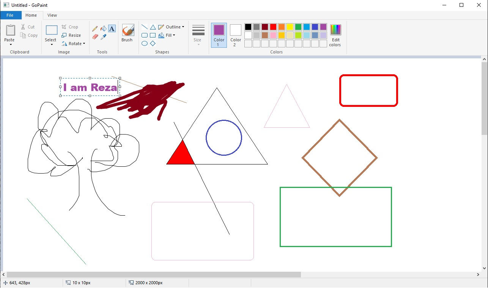

# gopaint
GoPaint is a paint program written in Go similar to the Windows 10's built-in drawing program. It's only an alpha release and lacks many features. 

I started leanring Go programming language recently and I wanted to make a complete application or maybe like clone of another application. So I ended up creating this paint program. Actually this program is my first ever Go project and I'm glad to share it with everyone :D

This is only an alpha which means it probably has many buggs and not so stable. I will try to improve the codes over time and if anyone else want to help improving the codes, you are welcomed.

Lots of techniques that I used in order to implement various features of the application is kinda hardcoded and I believe those stufs can be done in more easier ways but to be very honest I had very fun making this project and I was kinda experimenting with the codes and techniques. In the very beginning of making this project I only planned making a small clone of the Windows 10 paint then I ended up experimenting with it. For example, for the Text Tool, I implemented my own text editing system (still incomplete) instead of using a text edit control from windows api. But again, I had fun doing it and I learned a lot from it. Hope you guys will find it helpful too. 

This paint application is mainly targated for windows since I used all the native windows api functions and gdi32, gdi+ for all the graphical stuffs. 

Any kind of suggestions are welcomed!

