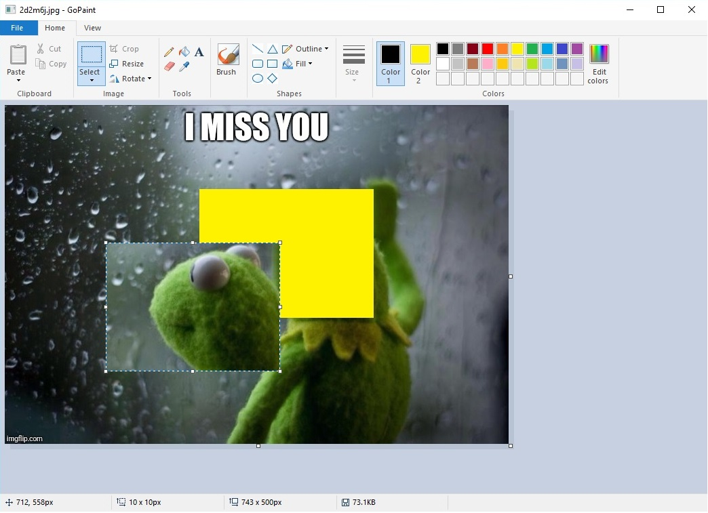

# GoPaint
GoPaint is a paint program written in Go similar to the Windows 10's built-in drawing program. It's only an alpha release and lacks many features. 

## Background
I started leanring Go programming language recently and I wanted to develop a complete application something graphics related. And I ended up creating this paint program. Actually this program is my first ever Go project and I'm excited to share it with everyone.

This is only an alpha which means it probably has many buggs and not so stable. I still haven't tested much and still under development. I will try to improve the codes over time and if anyone else want to help improving the codes, you are welcomed.

## Codes
Lots of techniques that I used in order to implement various features of the application is kinda hardcoded and I believe those stuffs can be done in more easier ways. But to be very honest I had very fun making this project and I was kinda experimenting with the codes and techniques which helped me a lot learning Go language. In the very beginning of developing this project I planned only making a small clone of the Windows 10 paint then I ended up experimenting a lot with it. For example, for the Text Tool, I implemented my own text editing system (still incomplete) where I could probably just use a text edit control from the Windows api. But again, I had fun doing it and I learned a lot from it. Hope you guys will find it helpful too. 

## Dependencies
Oviously the codes are not platform independent since I used all the native Windows api functions for GUI stuffs and Gdi32, Gdi+ for all the graphical stuffs and they are literally all over the place. 

Some external Go packages are used to develop this application - 

	- The Windows API wrapper from lxn. Link - https://github.com/lxn/win
	- 'Go Graphics' is used only for the Brush Tool. Link - https://github.com/fogleman/gg
	- Go Images for additional formats encoding/decoding. Link - https://github.com/golang/image

During bulding this application I made two internal packages for convinience and more cleaner design. I sepereated the GUI codes from the main package and put it into a new internal package named 'reza'. Also I made a GDI+ wrapper package named 'gdiplus'. For now both packages are included as internal packages but I really have plan to move them as seperate packages and keep as seperate repositories on Github. So that people can use them for their projects. 

Any kind of suggestions are welcomed!

Selection Tool in action -

